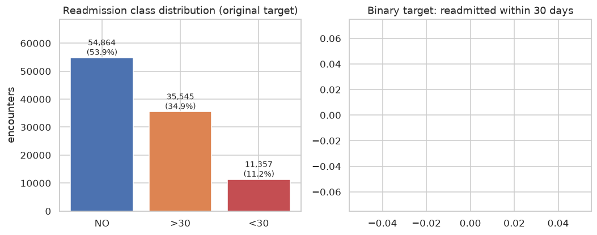
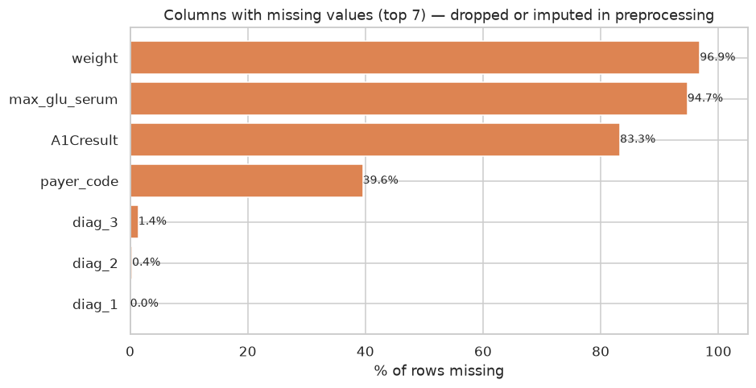
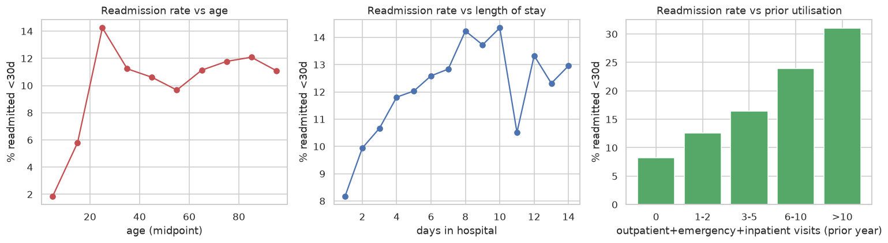
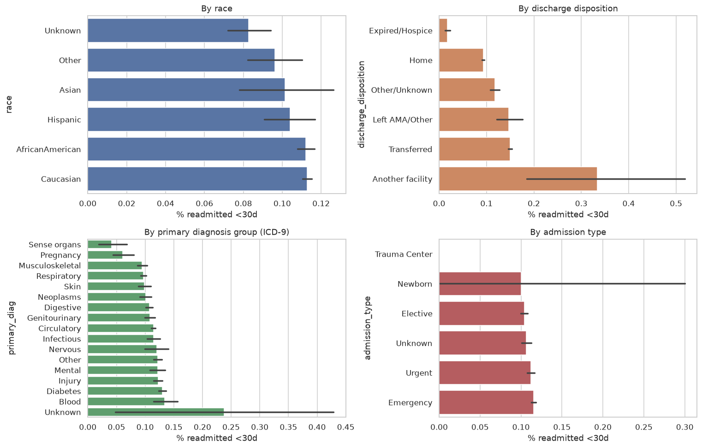
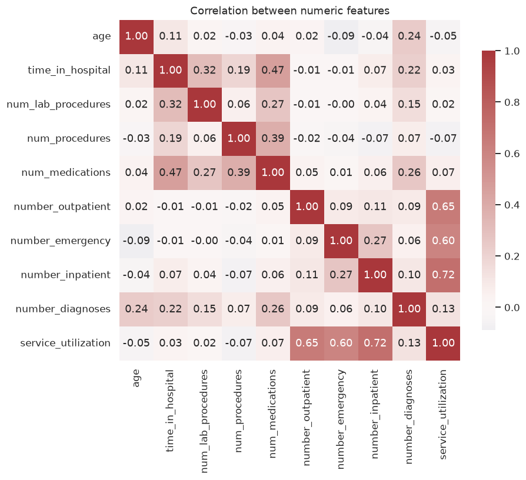
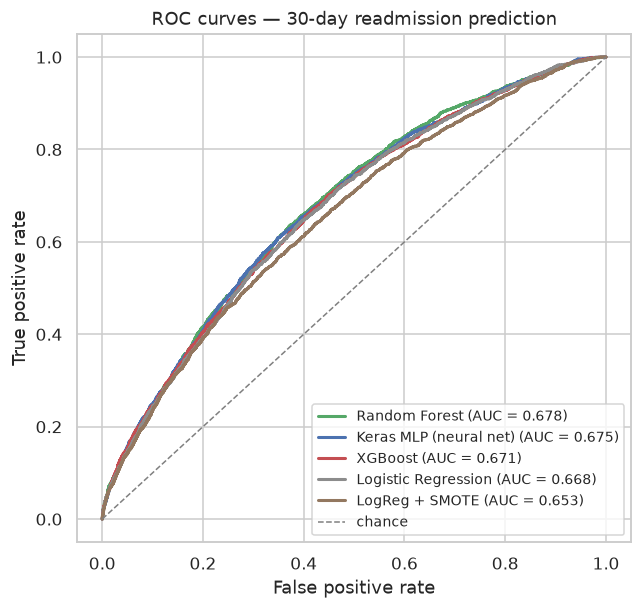
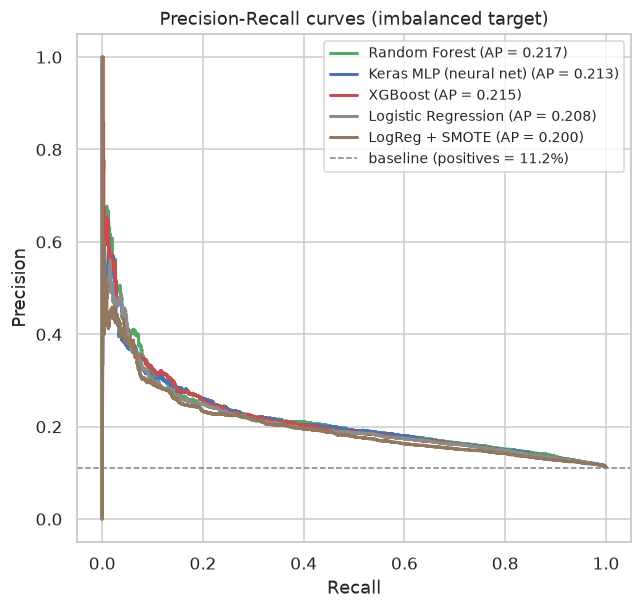
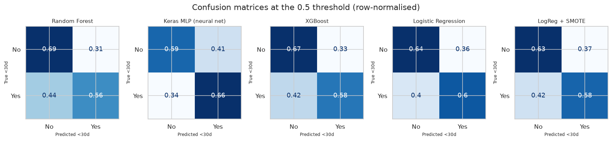
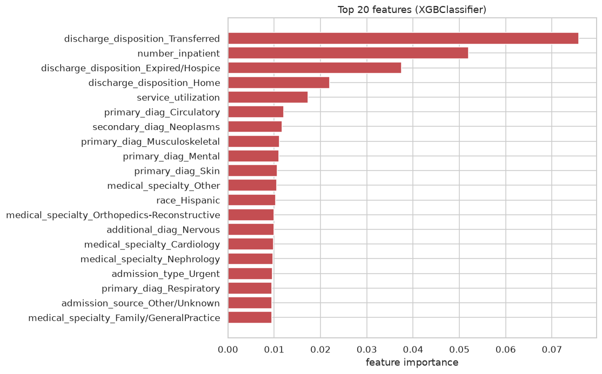

# 🏥 Predicting 30-Day Hospital Readmission for Diabetes Patients

An end-to-end data science project: **101,766 hospital encounters × 50 raw columns** of US
clinical data (1999–2008), cleaned, explored, engineered and modelled to predict whether a
diabetes patient will be **readmitted within 30 days** of discharge.

| | |
|---|---|
| **Dataset** | [Diabetes 130-US Hospitals for years 1999–2008](https://archive.ics.uci.edu/dataset/296/diabetes+130+us+hospitals+for+years+1999+2008) — UCI ML Repository, ID 296 |
| **Requirement check** | ✅ **101,766 rows** (> 100,000 required) · ✅ **50 columns** (≥ 35 required) |
| **Task** | Binary classification — `readmitted < 30 days` (positive rate **11.2%**) |
| **Models compared** | Logistic Regression · Random Forest · XGBoost · Keras neural network · SMOTE variant |
| **Best test ROC-AUC** | **0.678** (Random Forest) |

> **A note on column count:** the UCI catalogue page lists "55 attributes", but the actual
> `diabetic_data.csv` file ships **50 columns** (2 identifiers + 48 attributes incl. the
> target). This is a known quirk of the dataset page. Either way the assignment requirement
> of ≥ 35 columns is comfortably met.

---

## 1 · Problem statement

Hospital readmission shortly after discharge is expensive and often preventable. US
hospitals face financial penalties for excess 30-day readmissions, so flagging high-risk
diabetes patients **at discharge time** lets care teams prioritise follow-up contact,
medication reconciliation and diabetes education.

The dataset (Strack et al., 2014) covers 10 years of encounters at 130 US hospitals: lab
tests, medications, diagnoses (ICD-9), admission/discharge metadata and prior utilisation.

## 2 · Repository structure

```
AI_model-ASSIGNMENT/
├── README.md                      ← this report
├── requirements.txt               ← pinned environment
├── data/raw/                      ← dataset (gitignored; fetched by script)
├── notebooks/
│   ├── readmission_modeling.ipynb ← full EDA → modelling → evaluation notebook (executed)
│   └── build_notebook.py          ← generates the notebook from source
├── src/
│   ├── download_data.py           ← fetch + integrity-check the dataset
│   ├── preprocess.py              ← cleaning, ID decoding, ICD-9 grouping, features, split
│   ├── eda.py                     ← all EDA figures
│   ├── train.py                   ← trains + tunes all models, saves artifacts
│   └── evaluate.py                ← ROC/PR/confusion/importance figures + comparison table
├── models/                        ← trained artifacts (committed)
│   ├── best_model.joblib          ← probability-calibrated winner, served by the demo
│   ├── {logreg,random_forest,xgboost,logreg_smote}.joblib, keras_mlp.keras
│   ├── preprocessor.joblib, metrics.json, preds_test.npz, default_patient.json
├── reports/
│   ├── figures/                   ← all 12 figures (embedded below)
│   └── model_comparison.md
└── app/app.py                     ← Streamlit demo app
```

## 3 · Reproduce / run

```bash
pip install -r requirements.txt

python src/download_data.py    # fetch dataset into data/raw/ (verifies rows & columns)
python src/eda.py              # regenerate EDA figures
python src/train.py            # full pipeline: tune + train 5 models + save artifacts
python src/evaluate.py         # evaluation figures + comparison table

streamlit run app/app.py       # interactive demo (needs models/ from the step above)
```

The executed notebook `notebooks/readmission_modeling.ipynb` walks through the identical
pipeline using the same `src/` modules — one source of truth for all logic.

> In this sandbox the UCI/Kaggle hosts are unreachable, so `src/download_data.py` pulls a
> verified byte-identical mirror of the dataset from GitHub (`taspinar/siml`) and asserts
> the exact shape (101,766 × 50) and the published class counts after download.

## 4 · Exploratory Data Analysis

### 4.1 A heavily imbalanced target



Only **11.2%** of encounters end in a readmission within 30 days. Consequence: accuracy is
a misleading metric (predicting "never" scores 88.8%), so the project optimises and reports
**ROC-AUC and PR-AUC**, plus precision/recall/F1 at the operating threshold.

### 4.2 Missing data uses the `?` code



- `weight` — 97% missing → **dropped**
- `payer_code` — 40% missing, weak signal → **dropped**
- `medical_specialty` — 49% missing → kept with an explicit `Missing` category (the *fact*
  that no specialty is recorded is itself informative)
- `citoglipton` / `examide` — constant for every row → **dropped**

### 4.3 What drives early readmission



- Risk **rises with age**.
- Risk is *highest for the shortest stays* (1–3 days) — plausibly patients discharged too
  early.
- Risk **explodes with prior-year utilisation** (outpatient + emergency + inpatient
  visits): patients with >10 prior visits are readmitted at ~2.5× the average rate.



Discharge disposition is the strongest categorical signal: patients **transferred to
another facility** are readmitted far more often; patients discharged to
**hospice/expired** essentially never return. Diagnosis mix (circulatory, diabetes
complications) matters too.



Numeric features are only mildly collinear — the biggest pair (`num_medications` vs
`time_in_hospital`, r ≈ 0.47) is weak enough to keep both.

Medication data (`reports/figures/07_medication_usage.png`): insulin dominates (~54% of
patients); 15 of the 23 diabetes drugs are prescribed to <2% of patients, which motivates
aggregating them into a count feature rather than 23 sparse indicators.

## 5 · Preprocessing & feature engineering (`src/preprocess.py`)

| Step | Detail |
|---|---|
| **Drop** | `encounter_id`, `patient_nbr` (identifiers) · `weight` (97% missing) · `payer_code` (40% missing) · `citoglipton`, `examide` (constant) |
| **Decode** | `admission_type_id` / `discharge_disposition_id` / `admission_source_id` → clinical categories via `IDs_mapping.csv` (discharge grouped into 6 buckets, e.g. *Home*, *Transferred*, *Expired/Hospice*) |
| **Group** | ~700 distinct ICD-9 diagnosis codes → **17 disease groups** (circulatory, respiratory, diabetes, neoplasms, …) for each of `diag_1/2/3` |
| **Ordinal-encode** | age brackets → midpoints · 21 medication columns → {No:0, Down:1, Steady:2, Up:3} · HbA1c / glucose serum → severity ordinal |
| **Engineer** | `service_utilization` = outpatient+emergency+inpatient visits (prior year) · `n_active_medications` · `lab_monitoring_score` (0 = glucose & HbA1c never measured) |
| **One-hot** | 9 categorical features → 94 indicator columns (final matrix: **106 features**) |
| **Target** | `readmitted ∈ {NO, >30, <30}` → binary: `<30` = 1, else 0 |
| **Split** | Stratified 80/20 → **81,412 train / 20,354 test** (`random_state=42`) |

All **101,766 encounters are kept** (the assignment requires > 100,000 rows). Notably this
includes a few thousand hospice/expired discharges — clinically they cannot be readmitted,
and the model learns exactly that.

## 6 · Modelling (`src/train.py`)

Five models on the identical split, all handling the 11% positive rate:

1. **Logistic Regression** — linear baseline, `class_weight="balanced"`, C = 0.5
2. **Random Forest** — tuned by `RandomizedSearchCV` (3-fold, ROC-AUC, 6 candidates over
   depth / min-samples-leaf / max-features) → `max_depth=14, min_samples_leaf=10, max_features="sqrt"`, 400 trees
3. **XGBoost** — tuned similarly (8 candidates) → `learning_rate=0.05, max_depth=6, colsample_bytree=0.9`, 500 trees, `scale_pos_weight ≈ 8`
4. **Keras MLP (neural network)** — 106 → 256 → 128 → 64 → 1 with dropout (0.3/0.3/0.2),
   Adam, batch 256, early stopping on validation AUC (stopped at epoch 10 of 40)
5. **SMOTE + LogReg** — oversampling alternative to class weights

Preprocessing lives inside each model as a sklearn `Pipeline` (one-hot + standard scaling)
— no train/test leakage: the transformer is fitted on the training fold only.

## 7 · Results (20,354-row hold-out)

| Model | ROC-AUC | PR-AUC | Accuracy | Precision | Recall | F1 | Fit time |
|---|---|---|---|---|---|---|---|
| **Random Forest** 🏆 | **0.6777** | 0.2167 | 0.6780 | 0.1854 | 0.5557 | 0.2781 | 15s |
| Keras MLP (neural net) | 0.6750 | 0.2126 | 0.6009 | 0.1695 | **0.6609** | 0.2698 | 24s |
| XGBoost | 0.6709 | 0.2154 | 0.6570 | 0.1786 | 0.5764 | 0.2727 | 4s |
| Logistic Regression | 0.6684 | 0.2077 | 0.6387 | 0.1745 | 0.5997 | 0.2703 | 4s |
| LogReg + SMOTE | 0.6535 | 0.1996 | 0.6284 | 0.1662 | 0.5804 | 0.2585 | 7s |









**Reading the results**

- Tree ensembles lead, the neural network is a close second, and the linear baseline is
  only ~0.01 AUC behind — with ~100k rows of mostly categorical, low-interaction features,
  tabular data favours trees, and there is limited headroom for any model.
- **PR-AUC ≈ 0.22** vs a 0.11 baseline: doubling the precision of flagged patients, but
  precision collapses at high recall — the operating threshold must be chosen per hospital
  (missed patients vs intervention capacity), not defaulted to 0.5.
- **Class weighting beats SMOTE** on every metric here, at a fraction of the compute.
- Feature importance is clinically coherent: **discharge disposition** (transferred /
  hospice / home), **prior inpatient visits**, **service utilisation** and the **diagnosis
  mix** dominate — exactly what the readmission literature reports.

**Serving calibration** — class-weighted models inflate absolute probabilities (an
average patient scored ~0.42 vs a true base rate of 0.11). The model served in the demo
(`models/best_model.joblib`) is therefore the Random Forest wrapped in
`CalibratedClassifierCV` (isotonic, 3-fold). Ranking metrics are unchanged, but the
displayed risk is now a genuine probability. Full numbers: `models/metrics.json`
(`served_model` section).

## 8 · Demo app

`streamlit run app/app.py` → edit a patient profile (age, admission type, length of stay,
prior utilisation, diagnosis group, labs…) and get an instant calibrated readmission risk
with comparison to the population base rate.

## 9 · Conclusions & limitations

**What was built:** a fully reproducible pipeline (download → EDA → preprocessing →
tuning → 5-model comparison → calibrated serving model → demo app) on a 101,766-row
clinical dataset, with an executed notebook, committed artifacts and figures.

**Honest limitations**

- ROC-AUC ~0.68 means moderate discrimination: 30-day readmission is genuinely hard to
  predict from administrative data (published results on this dataset land in the same
  range; lab values are mostly missing by policy, and social determinants are absent).
- The dataset is 1999–2008 US data — temporal and geographic drift make deployment a
  non-trivial transfer problem.
- All 101,766 rows were retained to satisfy the assignment's row count, including
  hospice/expired discharges (clinically one would exclude them).
- Fairness was not audited (race/age differences in error rates) — flagged as next step.

**Next steps:** richer medication-change features, threshold optimisation against
intervention costs, survival analysis for time-to-readmission, fairness audit.

## 10 · Environment

Python 3.11 · pandas 3.0 · scikit-learn 1.9 · XGBoost 3.2 · TensorFlow 2.21 (CPU) ·
imbalanced-learn · Streamlit — see `requirements.txt`. All randomness seeded
(`random_state=42`, TF seed 42); the notebook reproduces the CLI results (Keras varies
~±0.002 AUC with CPU threading).
